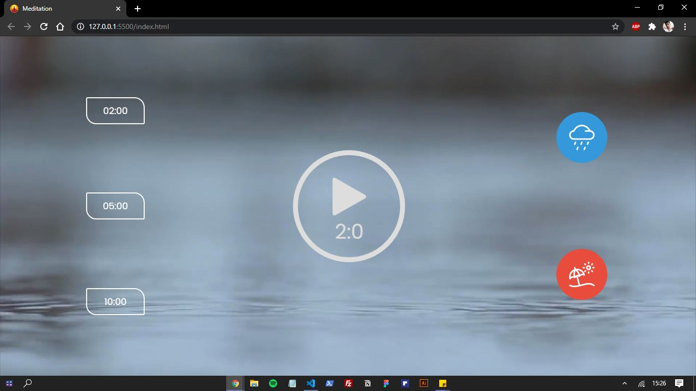
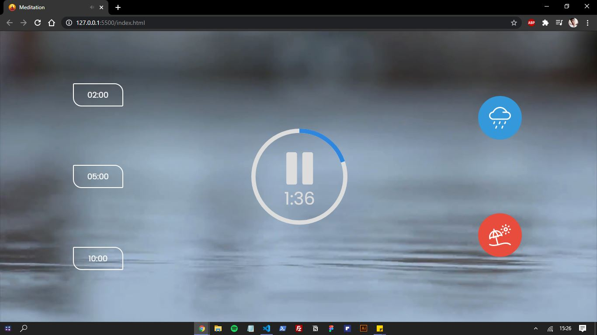
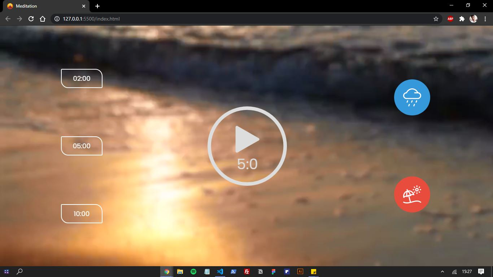

<h1 align="center">Meditação<h1>

## Descrição ✍️

  Um app para meditação, feito com javascript.

&nbsp;

  
  
  
  

 <a href="#objetivo">Objetivo</a> •
 <a href="#tecnologias">Tecnologias</a> •
 <a href="#features">Features</a> •
 <a href="#autor">Autor</a>

## Objetivo 🚀

  Manipular áudio e vídeo e timer utilizando javascript.

&nbsp;
## Tecnologias 👩‍💻

 
 - HTML
 &nbsp;

 - CSS
 &nbsp;

 - JS

&nbsp;
## Features 🆕

  ✅ Dois áudios para meditar (chuva e ondas);
  &nbsp;

  ✅ Três timers disponíveis.

&nbsp;
## Autor
<a style="text-decoration: none;" href="https://github.com/olagregs">
  
  
Gregory Ferreira 💻

</a>

Made with ❤️ and ☕ by me 😁

&nbsp;